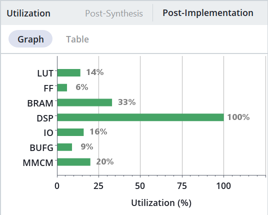

# mandelbrUlt
## A fast (2.0 GigaIters/s) interactive Mandelbrot generator for the Commodore 64 Ultimate

Features:
- S-Video output: PAL 352x256 @ 50Hz, 256 colors.
- Interactive controls via joystick (port 2).
- 20 asynchronous parallel Mandelbrot cores running at 100 MHz reaching 2.0 GigaIters/s.
- Brute force calculation (all pixels are always recalculated).

# REQUIREMENTS

- A Commodore 64 Ultimate.
- Composite or S-Video cable. NOTE: HDMI output is not yet supported.
- A monitor/TV compatible with PAL.
- A way to load and run the FPGA core (see this project: https://github.com/0x444454/look_ma_no_vic).
- Joystick in port 2.

# CONTROLS

Use **joystick in port 2**:
- Up, Down, Left, Right: Move around in complex plane.  

Keep Joystick button pressed for these actions:
- Fire + Up: Zoom in 2x.
- Fire + Down: Zoom out 2x.
- Fire + Left: Increase iterations.
- Fire + Right: Decrese iterations.
- Fire (and nothing else) pressed for 2 seconds: Cycle palette.

Motherboard **LED**:
- Lit = Calculating
- Off = Idle

# SUPPORTED RESOLUTIONS
- 352x256, 256 colors.

The default number of max iterations is 128, but the user can interactively change them in the range [16..4095].  

The simple coloring algorithm maps the lowest 8-bits of a pixel iterations to a palette of 256 colors.

# ALGORITHM

### Mandelbrot calculation

This is a brute force algorithm using Q3.22 fixed-point precision.  
We don't need heuristic optimizations, as we can reach interactive rates also at the maximum 4095 iters/pixel.  
The dirty work is done by the **20 Mandelbrot calculation cores** working in parallel at 100 MHz.  
Each core uses 6 DSP48E1 resources on the FPGA to calculate 1 Mandelbrot iteration per clock cycle. Aggregate computational power of all 20 cores (120 DSP) is 2.0 GigaIters/sec.  

Each cycle, if a core has completed calculation, we write the result to the BRAM framebuffer. We also schedule calculation of new pixels to free cores.  

### Note about fixed-point precision

There are two different fixed-point notations using "Q" numbers. TI and ARM. I am using ARM notation. More info here:  
https://en.wikipedia.org/wiki/Q_(number_format)  

The current implementation uses Q3.22 (25 bits total).
The Mandelbrot set is contained in a circle with radius 2. However, during calculation, numbers greater than 2 are encountered, depending on the point being calculated.  
Here is the maximum magnitude reached for each point during the calculation:  

Q3.22 (25 bits) is the best compromise between max-zoom and speed for the Artix7 FPGA.  
We use 25-bit numbers to maximize usage of DSP48E1 resources in the Artix7.  
Even if we use 25-bits number, we can perform the Mandel escape test on mult partials using more bits (Q6.44). This is unlikely many CPU mult implementations, and allows using only 3 bits (Q3) for the integral part of the calculation registers, and allocate more bits (22) to the fractional part for a deeper zoom.

### FPGA Utilization

This is on a Xilinx XC7A50T. Notice how we use all 10 (100%) DSP48E1 blocks and only 3% BRAM (as HDMI and calculation buffers), while other FPGA resources are mostly free. 
We also use almost all external SRAM for the framebuffer (960x544 = 522240 bytes out of 524288).

# PROBLEMS / FAQ

### Why no HDMI output ?

I am still trying to understand how to configure the HDMI encoder.

### Why only 256 colors, even if 4096 iters are supported ?

I was too lazy to prepare a new good 4096-color palette. Next version ! :)  

### Can I customize the palette ?

Sure. Change it here: [palette_yuv_256.hex](sources/src/palette_yuv_256.hex)

# LICENSE

Creative Commons, CC BY

https://creativecommons.org/licenses/by/4.0/deed.en

Please add a link to this github project.
